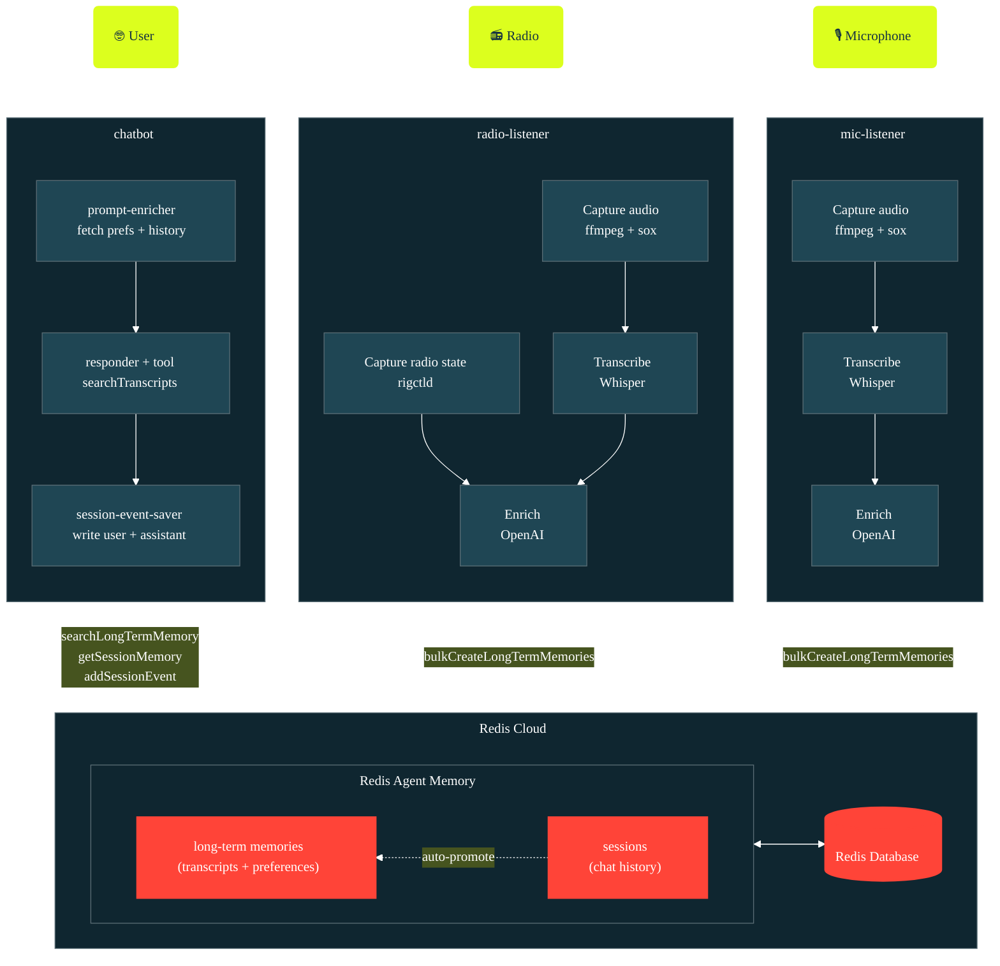

```mermaid
%%{init: {
  'theme': 'base',
  'themeVariables': {
    'background': '#163341',
    'primaryColor': '#1F4654',
    'primaryTextColor': '#FFFFFF',
    'primaryBorderColor': '#5A6D75',
    'lineColor': '#FFFFFF',
    'clusterBkg': '#0F2630',
    'clusterBorder': '#5A6D75',
    'titleColor': '#FFFFFF',
    'fontFamily': 'Inter, system-ui, sans-serif'
  },
  'flowchart': {
    'padding': 24,
    'nodeSpacing': 40,
    'rankSpacing': 60,
    'subGraphTitleMargin': { 'top': 8, 'bottom': 24 }
  }
}}%%
flowchart TD
    USER("🤓 User")
    RADIO("📻 Radio")
    MIC("🎙️ Microphone")
    REDIS[("Redis Database")]

    subgraph CB["chatbot"]
        direction TD
        C1["prompt-enricher<br/>fetch prefs + history"]
        C2["responder + tool<br/>searchTranscripts"]
        C3["session-event-saver<br/>write user + assistant"]
        C1 --> C2 --> C3
    end

    USER <--> CB

    subgraph RL["radio-listener"]
        direction TD
        R1["Capture radio state<br/>rigctld"]
        R2["Capture audio<br/>ffmpeg + sox"]
        R3["Transcribe<br/>Whisper"]
        R4["Enrich<br/>OpenAI"]
        R1 --> R4
        R2 --> R3 --> R4
    end

    RADIO --> RL

    subgraph ML["mic-listener"]
        direction TD
        M1["Capture audio<br/>ffmpeg + sox"]
        M2["Transcribe<br/>Whisper"]
        M3["Enrich<br/>OpenAI"]
        M1 --> M2 --> M3
    end

    MIC --> ML

    subgraph RC["Redis Cloud"]
        subgraph AM["Redis Agent Memory"]
            direction RL
            SES["sessions<br/>(chat history)"]
            LT["long-term memories<br/>(transcripts + preferences)"]
            SES -. auto-promote .-> LT
        end
        AM <--> REDIS
    end


    CB <-->|searchLongTermMemory<br/>getSessionMemory<br/>addSessionEvent| RC
    RL -->|bulkCreateLongTermMemories| RC
    ML -->|bulkCreateLongTermMemories| RC


    classDef external fill:#DCFF1E,stroke:#DCFF1E,color:#163341,stroke-width:2px
    classDef pipeline fill:#1F4654,stroke:#5A6D75,color:#FFFFFF
    classDef memory fill:#FF4438,stroke:#FF4438,color:#FFFFFF,stroke-width:2px

    class USER,RADIO,MIC external
    class C1,C2,C3,R1,R2,R3,R4,M1,M2,M3 pipeline
    class SES,LT,REDIS memory
```
